# 영속성 관리

## 목차

- 엔티티 매니저 팩토리와 엔티티 매니저
- 영속성 컨텍스트란?
- 엔티티의 생명주기
- 영속성 컨텍스트의 특징
- 플러시
- 준영속

## 1.엔티티 매니저 팩토리와 엔티티 매니저

### 엔티티 매니저 팩토리란?

- 엔티티 매니저 팩토리는 엔티티 매니저를 생성하는 객체입니다.
- 엔티티 매니저 팩토리 특징
    - 객체를 만드는 비용이 큽니다.
    - 엔티티 매니저 팩토리 객체를 한개만 만들어 애플리케이션 전체에서 공유합니다.
    - 팩토리 객체에서 엔티티 매니저를 생성하는 비용은 거의 들지 않는다.
    - 쓰레드 세이프합니다. 단, 엔티티 매니저는 쓰레드 세이프하지 않으므로 공유하면 안됩니다.

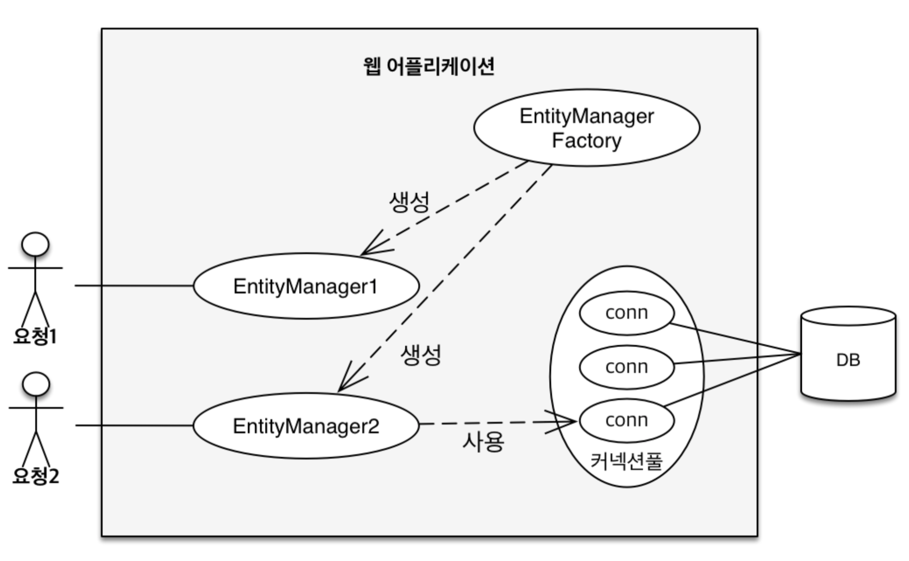

- 하나의 엔티티 매니저 팩토리가 다수의 엔티티 매니저를 생성합니다.
- EntityManager1은 데이터베이스 연결을 하고 있지 않습니다. 엔티티 매니저는 계속 연결을 하지 않고 있다가 데이터베이스 연결
  이 필요한 시점에 연결을 합니다.

## 2.영속성 컨텍스트란?

- 영속성 컨텍스트(Persistence Context) : 엔티티를 영구적으로 저장하는 환경
- 엔티티 매니저로 엔티리를 저장하거나 조회하면 **엔티티 매니저는 영속성 컨텍스트에 엔티티를 보관하고 관리**한다.

```
em.persist(member);
```

- 엔티티 매니저를 사용해서 회원 엔티티(member)를 영속성 컨텍스트에 저장합니다.

```
참고 : 여러 엔티티 매니저가 같은 영속성 컨텍스트에 접근할 수도 있습니다.
```

## 3.엔티티의 생명주기

- [비영속(new/transient)](#비영속) : 영속성 컨텍스트와 전혀 관계가 없는 상태
- [영속(managed)](#영속) : 영속성 컨텍스트에 저장된 상태
- [준영속(detached)](#준영속) : 영속성 컨텍스트에 저장되었다가 분리된 상태
- [삭제(removed)](#삭제) : 삭제된 상태


### 비영속

- 영속성 컨텍스트와 데이터베이스와 관련 없는 상태
- 엔티티 객체를 생성하였지만 아직 저장하지 않은 상태

```
Member member = new Member();
member.setId("member1");
member.setUsername("회원1");
```

- member 엔티티 객체는 객체는 생성하였지만 영속성 컨텍스트에 저장되지 않아 비영속 상태입니다.

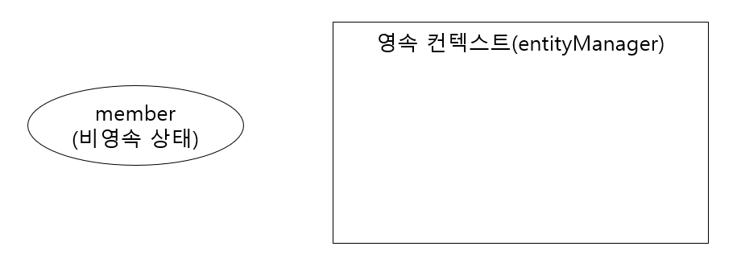

- 위 그림은 em.persist() 호출전의 비영속 상태인 member 엔티티 객체를 나타냅니다.

### 영속

- 영속 상태 : **영속성 컨텍스트가 관리하는 엔티티를 영속 상태**라고 합니다.
- 엔티티 매니저를 통하여 엔티티 객체를 영속성 컨텍스트에 저장하게 되면 영속 상태가 됩니다.
- em.find(), JPQL을 사용해서 **조회한 엔티티도 영속성 컨텍스트가 관리하는 영속 상태**입니다.

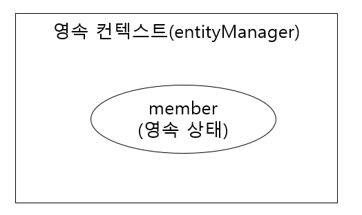

### 준영속

- 준영속 상태 : 영속성 컨텍스트가 관리하던 영속 상태의 엔티티를 영속성 컨텍스트가 관리하지 않게 된 상태
- 준영속 상태로 만들기 위해서는? : em.detach(member), em.close(), em.clear()
- em.detach(member), em.close(), em.clear() 비교
    - em.detach(member) : 특정 엔티티만 준영속 상태로 만듭니다.
    - em.close() : 영속성 컨텍스트 자체를 종료하여 준영속 상태로 만듭니다.
    - em.clear() : 영속성 컨텍스트 자체를 종료하지는 않고 안에 관리하는 엔티티를 초기화합니다.

### 삭제

- 삭제 상태 : 엔티티를 영속성 컨텍스트와 데이터베이스에서 삭제된 상태
- em.remove(member)

## 4.영속성 컨텍스트의 특징

- 영속성 컨텍스트와 식별자 값
    - 영속성 컨텍스트는 엔티티를 식별자 값(@Id로 테이블의 기본 키와 매핑한 값)으로 구분합니다.
    - 영속 상태의 엔티티는 반드시 식별자 값이 있어야 합니다.
    - 식별자 값이 없는 경우 예외가 발생합니다.
- 영속성 컨텍스트와 데이터베이스 저장
    - 영속성 컨텍스트가 엔티티를 데이터베이스에 저장하는 시점은? : JPA가 트랜잭션을 커밋하는 순간 (플러시, flush)
    - 영속성 컨텍스트는 엔티티 저장시 플러시(flush)하여 데이터베이스에 반영합니다.
- 영속성 컨텍스트가 엔티티를 관리시 장점
    - 1차 캐시
    - 동일성(identity) 보장
    - 트랜잭션을 지원하는 쓰기 지연
    - 변경 감지
    - 지연 로딩

### 4.1.엔티티 조회

- 엔티티 컨텍스트는 내부에 캐시를 가지고 있습니다. (**1차 캐시**)
- 1차 캐시에 영속 상태의 엔티티가 전부 저장됩니다.
- 1차 캐시는 **Map**으로 구성되어 있고, **key=@Id로 매핑한 식별자**, **value=엔티티 객체** 입니다.

```
// 엔티티 생성 (비영속)
Member member = new Member();
member.setId("member1");
member.setUsername("회원1");

// 엔티티 저장 (영속)
em.persist(member);
```

- 위 코드 실행시 1차 캐시에 회원 엔티티를 저장합니다.
- 회원 엔티티는 아직 데이터베이스에 저장되지 않은 상태입니다.


#### 1차 캐시에서 조회

1차 캐시에서 조회 코드와 그림

```
Member member = new Member();
member.setId("member1");
member.setUsername("회원1");

// 1차 캐시에 저장
em.persist(member);

// 1차 캐시에서 조회
Member findMember = em.find(Member.class, “member1”)
```

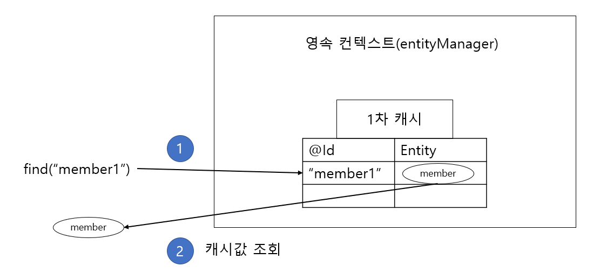

- em.find()를 호출하여 우선적으로 1차 캐시에서 식별자 값으로 엔티티를 탐색합니다.
- 찾는 엔티티가 있으면 데이터베이스를 조회하지 않고 **메모리에 있는 1차 캐시에서 엔티티를 조회**합니다.

#### 데이터베이스에서 조회

찾고자 하는 엔티티가 1차 캐시에 없어서 데이터베이서 조회하는 경우

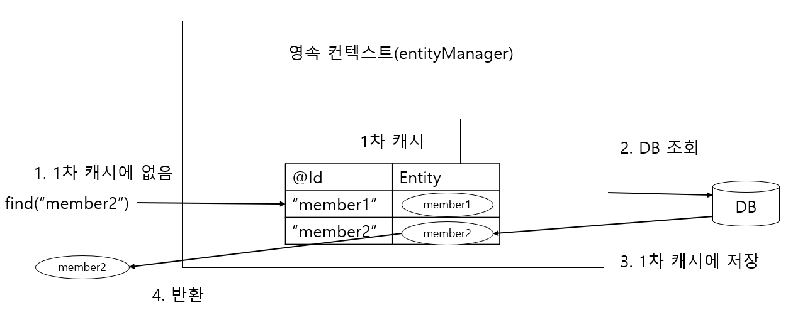

1. em.find(Member.class, "member2")를 실행합니다.
2. member2가 1차 캐시에 없으므로 DB에 조회합니다.
3. 탐색된 member2를 1차 캐시에 저장합니다. (영속 상태)
4. member2를 반환합니다.

#### 영속 엔티티와 동일성 보장

```
Member a = em.find(Member.class, "member1");
Member b = em.find(Member.class, "member2");

System.out.println(a == b); // 동일성 비교, true
```

위 두 엔티티 객체가 같은 이유는 무엇인가?

- 엔티티 조회시 같은 영속성 컨텍스트에 1차 캐시에 있는 엔티티 인스턴스를 가리키기 때문입니다.

동일성과 동등성

- 동일성(identity) : 실제 인스턴스가 같습니다. 이는 실제 물리적인 주소를 같은 값을 가집니다. 따라서 참조 값을 비교하는 == 비교의 값이 참이 됩니다.
- 동등성(equality) : 실제 인스턴스는 다를 수 있지만 **인스턴스가 가지고 있는 값이 같습니다.** 자바에서 동등성 비교는 equals() 메소드를 구현해야 합니다.

### 4.2.엔티티 등록

다음 예제는 엔티티 매니저를 사용해서 엔티티를 영속성 컨텍스트에 등록하는 예제입니다.

```
EntityTransaction transaction=em.getTransaction();
Member member1=new Member("member1","회원1",null);
Member member2=new Member("member2","회원2",null);

// 엔티티 매니저는 데이터 변경시 트랜잭션을 시작해야 한다.
em.persist(member1);
em.persist(member2);
// 여기까지 INSERT SQL을 데이터베이스에 보내지 않는다.

// 커밋하는 순간 데이터베이스에 INSERT SQL을 보낸다.
transaction.commit();
```

- 엔티티 매니저(em)는 트랜잭션을 커밋하기 전까지 데이터베이스에 엔티리를 바로 자정하지 않고 **내부 쿼리 저장소**에 INSERT SQL을 모아둡니다.
- 트랜잭션을 커밋할때 저장해둔 쿼리를 데이터베이스에 보냅니다. 이것을 **트랜잭션을 지원하는 쓰기 지연(transactional write-behind)** 라고 합니다.

위 코드에 대한 과정을 그림으로 표현하면 다음과 같습니다.
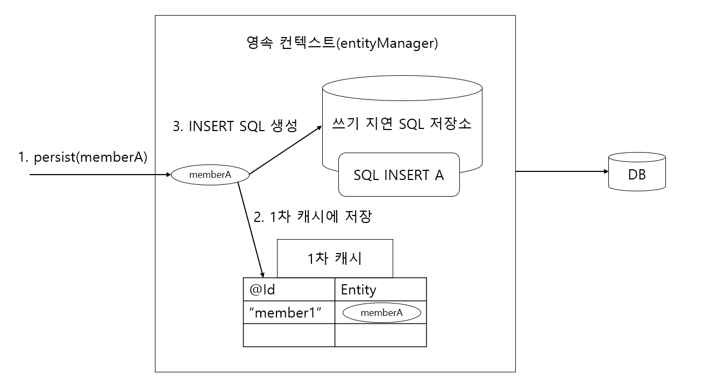

1. memberA를 영속화 시킵니다.
2. 영속성 컨텍스트는 1차 캐시에 회원 엔티티를 저장하면서 동시에 회원 엔티티 정보로 등록 쿼리를 만듭니다.
3. 만든 등록 쿼리를 쓰기 지연 SQL 저장소에 보관합니다.

memberB 엔티티 객체를 대상으로 다시 persist(memberB)를 수행합니다.

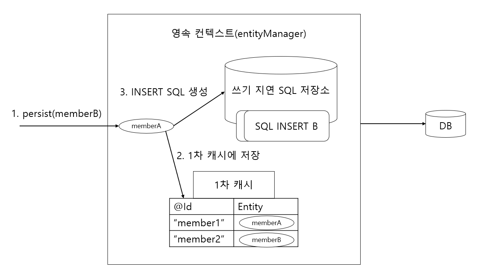

1. memberB를 영속화 시킵니다.
2. 영속성 컨텍스트는 1차 캐시에 memberB 엔티티를 저장하면서 동시에 memberB 엔티티 객체에 대한 정보로 등록 쿼리를 만듭니다.
3. 만든 등록 쿼리를 쓰기 지연 SQL 저장소에 추가합니다.

다음은 엔티티 매니저가 commit()을 수행합니다.

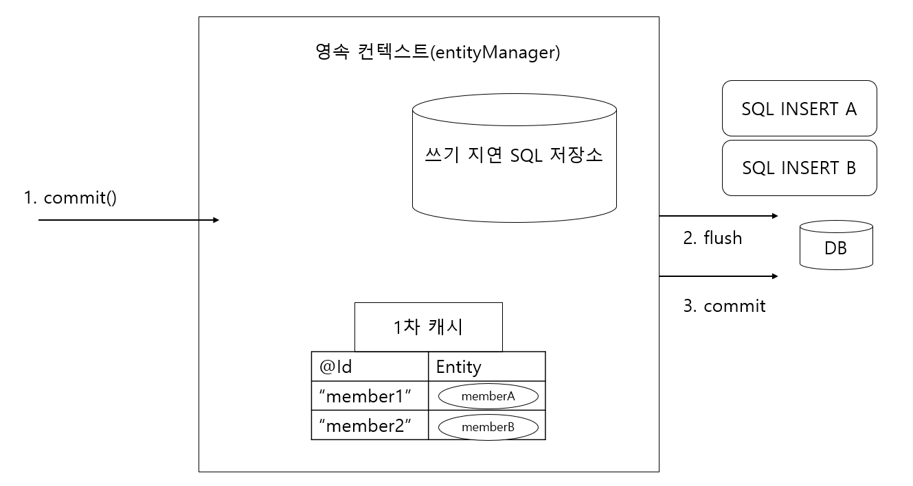

- 트랜잭션을 커밋하면 엔티티 매니저는 영속성 컨텍스트에 플러시합니다.
- 플러시(flush)란? : 영속성 컨텍스트의 변경 내용을 데이터베이스에 동기화하는 작업
    - 동기화하는 작업이란 구체적으로 무엇인가? : 등록, 수정, 삭제한 엔티티를 데이터베이스에 반영하는 것
- 플러시 작업을 통하여 영속성 컨텍스트의 변경 내용을 데이터베이스에 동기화하고 **실제 데이터베이스 트랜잭션을 커밋**합니다.

#### 트랜잭션을 지원하는 쓰기 지연이 가능한 이유

```
begin(); // 트랜잭션 시작

save(A);
save(B);
save(C);

commit(); //트랜잭션 커밋
```

위 로직에 대해서 2가지 경우를 생각해볼 수 있습니다.

1. 데이터를 저장하는 즉시, 등록 쿼리를 데이터베이스에 보내는 경우입니다. 위 예제에서 save() 메소드를 호출할 때마다
   즉시 데이터베이스에 등록 쿼리를 보냅니다. 그리고 마지막에 트랜잭션을 커밋합니다.
2. 데이터를 저장하면 **등록 쿼리를 데이터베이스에 바로 보내지 않고 메모리에 모아두는 경우**입니다.
   그리고 트랜잭션을 커밋할 때 모아둔 등록 쿼리를 데이터베이스에 보낸 후에 커밋합니다.

위 두 경우를 그림으로 표현하면 다음과 같을 것입니다.


- 위 두가지 경우 모두 트랜잭션 범위 안에서 실행되므로 둘의 결과는 같습니다.
- A,B,C 모두 트랜잭션을 커밋하면 함께 저장되고 롤백하면 함께 저장되지 않습니다.
- **등록 쿼리를 첫번째 경우처럼 그때 그때 데이터베이스에 전달해도 트랜잭션을 커밋하지 않으면 아무 소용이 없습니다.**
- 쓰기 지연이 가능한 이유
    - 어떻게든 커밋 직전에만 데이터베이스에 SQL을 전달하고 커밋만 하면 같은 결과가 나올 수 있기 때문에 가능합니다.
- 쓰기 지연 기능을 활용하면 모아둔 등록 쿼리를 데이터베이스에 한번에 전달해서 **성능을 최적화**할 수 있습니다.

### 4.3 엔티티 수정

#### SQL 수정 쿼리의 문제점

다음은 회원의 이름과 나이를 변경하는 쿼리입니다.

```
UPDATE MEMBER
SET
    NAME=?,
    AGE=?
WHERE
    id=?
```

위와 같은 쿼리가 있는 상태에서 회원의 등급을 변경하는 기능이 추가되면서 다음과 같은 쿼리가 추가될 수 있습니다.

```
UPDATE MEMBER
SET
    GRADE=?
WHERE
    id=?
```

위 2개의 쿼리를 하나로 합칠수도 있습니다.

```
UPDATE MEMBER
SET
    NAME=?,
    AGE=?,
    GRADE=?    
WHERE
    id=?
```

그런데 위와 같은 수정 쿼리에서 이름과 나이를 변경하는데 실수로 등급을 입력하지 않았거나 등급을 변경하는데 이름과 나이를
입력하지 않을 수 있습니다.

결국 첫번째와 두번째와 같은 수정 쿼리를 상황에 따라서 계속해서 추가할 것입니다.

위와 같은 수정 쿼리의 문제점은 다음과 같습니다.

- 수정 쿼리가 많아집니다.
- 비즈니스 로직을 분석하기 위해 SQL을 계속 확인하게 됩니다.
- 직접적이든 간접적이든 **비즈니스 로직이 SQL에 의존**하게 됩니다.

#### 변경감지

다음 예제는 JPA가 엔티티의 정보를 수정하는 예제입니다.

```
EntityManager em = emf.createEntityManager();
EntityTransaction transaction = em.getTransaction();

transaction.begin();
// 영속 상태 엔티티 조회
Member findMember = em.find(Member.class, "member1");

// 영속 엔티티 데이터 수정
findMember.setUsername("홍길동");
findMember.setAge(10);

// em.update(member); 이런 코드가 있어야 하지 않을까?

transaction.commit();
```

- JPA로 엔티티 수정시 update(이러한 메소드도 없음)와 같은 메소드를 따로 호출하지 않고 엔티티를 조회하여 데이터만 변경하면 됩니다.
- **변경 감지(drity checking)** : 엔티티의 변경사항을 데이터베이스에 자동으로 반영하는 기능

#### 변경감지 동작과정

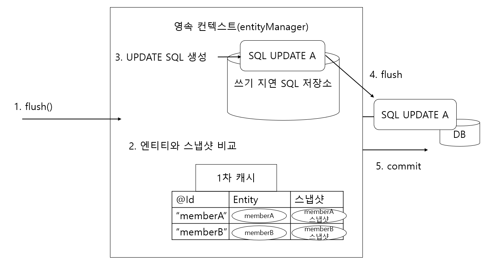

1. 트랜잭션을 커밋하면 엔티티 매니저 내부에서 먼저 플러시(flsuh())가 호출됩니다.
2. 엔티티와 스냅샷을 비교해서 변경된 엔티티를 찾습니다.
3. 변경된 엔티티가 있으면 수정 쿼리를 생성해서 쓰기 지연 SQL 저장소에 전달합니다.
4. 쓰기 지연 저장소의 SQL을 데이터베이스에 보냅니다.
5. 데이터베이스 트랜잭션을 커밋합니다.

```
스냅샷 : JPA는 엔티티를 영속성 컨텍스트에 보관할 때, 최초 상태를 복사해서 저장하는 것
변경감지 : 영속성 컨텍스트가 관리하는 영속 상태의 엔티티에만 적용됩니다. 
```

#### JPA 수정 기본 전략

- JPA가 수정할때의 기본 전ㅇ략은 엔티티의 변경된 부분만 수정하는 것이 아닌 모든 필드를 업데이트합니다.

```
UPDATE MEMBER
SET
  NAME=?,
  AGE=?,
  GRADE=?,
  ...
WHERE
  id=?
```

- 엔티티의 모든 필드를 업데이트시 장점
    - 모든 필드를 업데이트시 수정 쿼리가 항상 동일합니다(바인딩 되는 데이터는 다름). 따라서 애플리케이션 로딩 시점에 수정 쿼리
      를 미리 생성해두고 재사용할 수 있습니다.
    - 데이터베이스에 동일한 쿼리를 보내면 데이터베이스는 이전에 한번 파싱된 쿼리를 재사용할 수 있습니다.

#### JPA 수정 전략 설정 @DynamicUpdate

JPA 수정의 기본 전략은 모든 필드를 업데이트하는 것이지만 필드가 너무 많거나 자정되는 내용이 너무 크면,
**수정된 데이터만 사용해서 동적으로 UPDATE SQL을 생성하는 전략을 선택**할 수있습니다. 단, 이때는 하이버네이트
확장 기능을 사용해야 합니다.

```java

@Entity
@DynamicUpdate
@Table(name = "MEMBER")
public class Member {
    //...
}
```

- 위와 같이 @DynamicUpdate를 사용하면 수정된 데이터만 사용해서 동적으로 UPDATE SQL을 생성합니다.
- @DynamicUpdate와 비슷하게 데이터 삽입시 null이 아닌 데이터만 동적으로 저장할때 사용하는 **@DynamicInsert**도 있습니다.

```
참고 : 상황에 따라 컬럼이 30개 이상이 되면 기본 방법인 정적 수정 쿼리보다 @DynamicUpdate를 사용한 동적 수정 쿼리가 더 빠르다고 합니다.
```

### 4.4 엔티티 삭제

```
Member memberA = em.find(Member.class, "memberA");
em.remove(memberA)
```

- 삭제 쿼리가 지연 쓰기 저장소에 저장되어 있다가 commit() 호출시 데이터베이스에 반영됩니다.
- em.remove(memberA) 호출시 영속성 컨텍스트에서 memberA는 제거됩니다. 삭제된 엔티티는 가비지 컬렉션에 의해 제거됩니다.

## 5. 플러시

플러시(flush) : 영속성 컨텍스트의 변경 내용을 데이터베이스에 반영하는 기능

플러시 실행시 동작과정

1. **변경 감지**가 동작해서 영속성 컨텍스트에 있는 모든 엔티티를 스냅샷과 비교해서 수정된 엔티티를 찾습니다.
   수정된 엔티티는 수정 쿼리를 만들어 **쓰기 지연 SQL 저장소**에 등록합니다.
2. 쓰기 지연 SQL 저장소의 쿼리를 데이터베이스에 전송합니다. (등록, 수정, 삭제 쿼리)

영속성 컨텍스트 플러시 방법

1. em.flush() 직접 호출합니다.
2. 트랜잭션 커밋 시 플러시가 자동 호출됩니다.
3. JPQL 쿼리 실행시 플러시가 자동 호출됩니다.

직접 호출

- 엔티티 매니저(em)의 flush() 메소드를 직접 호출해서 영속성 컨텍스트를 강제로 플러시합니다.

트랜잭션 커밋 시 플러시 자동 호출

- 데이터베이스에 변경된 내용을 SQL로 전달하지 않고 트랜잭션을 커밋하면 어떤 데이터도 데이터베이스에 반영되지 않습니다.
- 위 문제를 해결하기 위해서 트랜잭션을 커밋할때 플러시를 자동으로 호출해야 합니다.

JPQL 쿼리 실행 시 플러시 자동 호출

- JPQL 쿼리 실행시 왜 플러시가 자동 호출되는가? : JPQL 쿼리 실행시 플러시가 되지 않고 조회를 수행한다면 영속성 컨텍스트에
  있지만 데이터베이스에는 반영되지 않은 엔티티 객체들이 조회가 되지 않는 문제가 있습니다.
- 위와 같은 문제를 해결하기 위해서 JPQL 호출할때도 플러시를 자동 호출합니다.
- 단, 식별자를 기준으로 조회하는 find() 메소드 호출시에는 플러시가 실행되지 않습니다.

```
em.persist(memberA);
em.persist(memberB);
em.persist(memberC);

// 중간에 JPQL 실행
query = em.createQuery("select m from Member m", Member.class);
List<Member> members = query.getResultList();
```

### 5.1 플러시 모드 옵션

- FlushModeType.AUTO : 커밋이나 쿼리를 실행할 때 플러시(기본값)
- FlushModeType.COMMIT : 커밋할 때만 플러시

```
em.setFlushMode(FlushModeType.COMMIT)
```

## 6.준영속

- 준영속 상태 : 영속성 컨텍스트가 관리하는 **영속 상태의 엔티티가 영속성 컨텍스트에서 분리된 것**을 준영속 상태라고 합니다.
- 준영속 상태로 만드는 방법
    - em.detach(entity) : 특정 엔티티만 준영속 상태로 전환
    - em.clear() : 영속성 컨텍스트를 완전히 초기화
    - em.close() : 영속성 컨텍스트를 종료

### 6.1.엔티리를 준영속 상태로 전환: detach()

- em.detach() : 특정 엔티티를 준영속 상태로 만듭니다.

```
public void detach(Object entity);
```

다음 코드는 detach() 메소드를 호출하여 영속 상태의 엔티티를 준영속 상태의 엔티리로 변경하는 예제입니다.

```java
public class EntityTest {

    // detach를 호출하여 특정 엔티티를 준영속 상태로 변경하면 영속성 컨텍스트가 엔티티를 관리하지 않는다.
    // 쓰기 지연 SQL 저장소의 INSERT SQL도 제거되어 데이터베이스에 저장되지도 않는다
    @Test
    public void detachEntity() {
        EntityTransaction transaction = em.getTransaction();
        Member member1 = Member.builder().id("member1").username("회원1").age(20).build();
        transaction.begin();
        em.persist(member1); // 영속상태

        em.detach(member1); // 준영속 상태

        TypedQuery<Member> query = em.createQuery("select m from Member m order by m.id",
            Member.class);
        List<Member> members = query.getResultList();

        Assertions.assertThat(members.size()).isEqualTo(0);

        transaction.rollback();
    }
}
```

- 영속 상태인 member1이 detach 메소드를 호출하여 준영속 상태가 되었습니다.
- 영속성 컨텍스트의 쓰기 지연 SQL 저장소에 있는 INSERT SQL도 사라집니다.

위 예제의 과정을 그림으로 표현하면 다음과 같습니다.


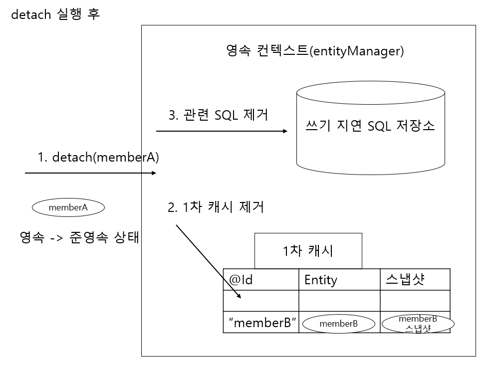

### 6.2.영속성 컨텍스트 초기화: clear()

- em.clear() : 영속성 컨텍스트의 내용을 초기화해서 해당 **영속성 컨텍스트의 모든 엔티티를 준영속 상태**로 만듭니다.

```java
public class EntityTest {

    // em.clear() 호출시 영속성 컨텍스트에 있는 엔티티는 초기화되어 준영속 상태가 됩니다.
    @Test
    public void clearEntityManager() {
        EntityManager em = emf.createEntityManager();
        EntityTransaction transaction = em.getTransaction();
        Member member1 = Member.builder().id("member1").username("회원1").age(20).build();

        transaction.begin();
        em.persist(member1);

        em.clear();

        // 준영속 상태
        member1.setUsername("홍길동");

        transaction.rollback();
    }
}
```

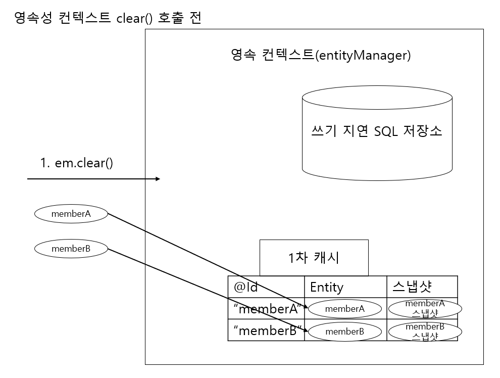

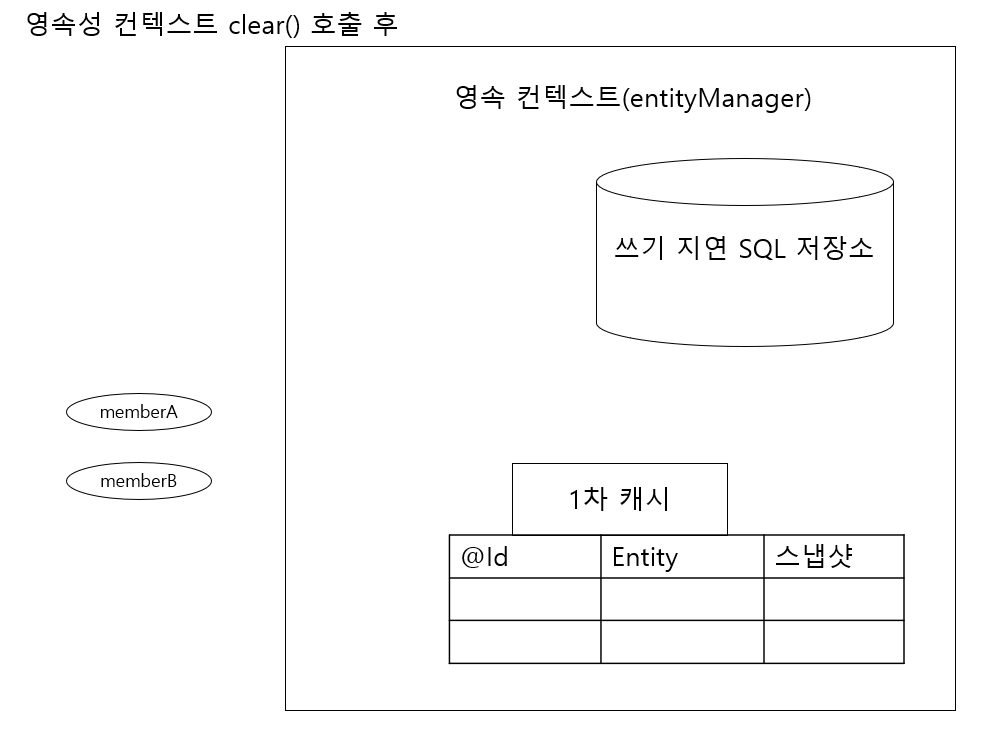

- em.clear() 호출 후 영속성 컨텍스트 안에 모든 것이 초기화됩니다.
- memberA, memberB는 준영속 상태가 됩니다.
- memberA.setUsername("changeName") 호출시 변경감지가 동작하지 않아서 데이터베이스에 반영되지 않게 됩니다.

### 6.3.영속성 컨텍스트 종료: close()

- em.close() : 영속성 컨텍스트가 종료되고, 영속성 컨텍스트가 관리하던 엔티티가 모두 준영속 상태가 됩니다.

```java
public class EntityTest {

    @Test
    public void closePersistenceContext() {
        EntityManager em = emf.createEntityManager();
        EntityTransaction transaction = em.getTransaction();
        Member member1 = Member.builder().id("member1").username("회원1").age(20).build();

        transaction.begin();
        em.persist(member1);

        em.close();

        transaction.rollback();
    }
}
```

- em.close() 호출시 member1 엔티티는 준영속 상태가 됩니다.

위 코드를 그림으로 표현하면 다음과 같습니다.

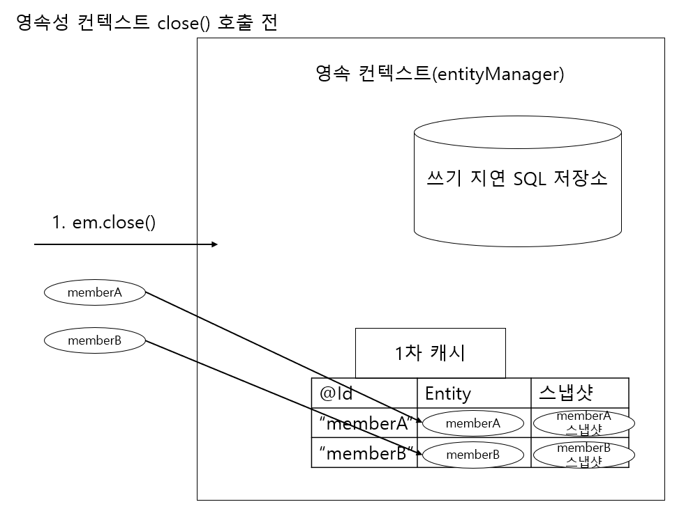


### 6.4.준영속 상태의 특징

준영속 상태의 엔티티는 다음과 같이 됩니다.

1. 거의 비영속 상태에 가깝게 됩니다.
    - 영속성 컨텍스트가 관리하지 않는 엔티티가 되기 때문에 1차 캐시, 쓰기 지연, 변경 감지, 지연 로딩을 포함한 영속성 컨텍스트가 제공하는 어떠한 기능도 동작하지
      않습니다.
2. 식별자 값을 가지고 있습니다.
    - 준영속 상태의 엔티티는 이미 한번 영속 상태였던 적이 있기 때문에 식별자 값을 가지고 있습니다.
3. 지연 로딩을 할 수 없게 됩니다.
    - 지연 로딩(Lazy Loading) : 실제 객체 대신 프록시 객체를 로딩해두고 해당 객체를 실제 사용할 때 영속성 컨텍스트를 통해 데이터를 불러오는 방법
    - 준영속 상태의 엔티티는 컨텍스트가 관리하지 않으므로 문제가 발생합니다.

### 6.5.병합: merge()

- 병합 : 준영속 상태의 엔티티를 다시 영속 상태로 변경하는 기능
- merge() 메소드는 준영속 상태의 엔티티를 받아서 그 정보로 **새로운 영속 상태의 엔티티**를 반환합니다.

merge() 메소드 정의

```
public <T> T merge(T entity);
```

merge() 사용 예시

```
Member mergeMember = em.merge(member);
```

#### 준영속 병합

merge() 메소드를 통하여 준영속 상태의 엔티티를 영속 상태로 변경할 수 있습니다.

```java
public class EntityTest {

    @Test
    public void mergeMember() {
        EntityManager em = emf.createEntityManager();
        EntityTransaction transaction = em.getTransaction();
        Member member1 = Member.builder().id("member1").username("회원1").age(20).build();

        transaction.begin();
        em.persist(member1);
        transaction.commit();
        em.close();

        // 준영속 상태에서 변경
        member1.setUsername("변경된 이름");

        em = emf.createEntityManager();
        transaction = em.getTransaction();
        transaction.begin();
        Member merge = em.merge(member1);
        transaction.commit();

        Assertions.assertThat(member1.getUsername()).isEqualTo("변경된 이름");
        Assertions.assertThat(merge.getUsername()).isEqualTo("변경된 이름");

        Assertions.assertThat(em.contains(member1)).isFalse();
        Assertions.assertThat(em.contains(merge)).isTrue();

        transaction = em.getTransaction();
        transaction.begin();
        em.remove(merge);
        transaction.commit();
    }
}

```

- member1 엔티티는 persist() 메소드에 의해서 영속 상태였다가 em.close() 메소드 호출로 인하여 준영속 상태로 변경됩니다.
- 준영속 상태인 member1은 새로운 영속성 컨텍스트의 merge 메소드를 호출하여 영속 상태가 됩니다. 그리고 merge 메소드의 반환 값으로
  새로운 영속 객체를 반환합니다.
- 새로운 영속 객체를 반환받은 merge 엔티티와 매개변수로 전달한 member1 준영속 엔티티는 서로 다른 객체가 됩니다.

merge 동작과정을 그림으로 표현하면 다음과 같습니다.

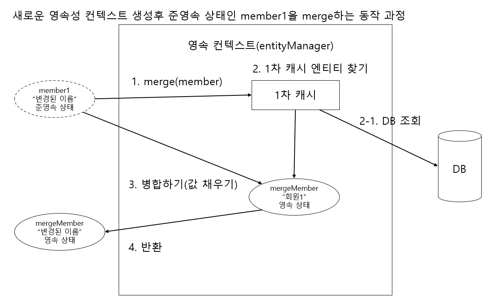

1. merge()를 실행합니다.
2. 파라미터로 넘어온 준영속 엔티티의 식별자 값으로 1차 캐시에서 엔티티를 조회합니다.
    1. 만약 1차 캐시에 엔티티가 없으면 데이터베이스에서 엔티티를 조회하고 1차 캐시에 저장합니다.
3. 조회한 영속 엔티티(mergeMember)에 member1 엔티티의 값을 채워 넣습니다.
   (member1 엔티티의 모든 값을 mergeMember에 덮어씁니다. 이때 mergeMember의 "회원1"이 "변경된 이름"으로 변경됩니다.)
4. mergeMember를 반환합니다.

* 파라미터로 전달한 준영속 상태의 member1과 새로운 영속 엔티티인 mergeMember는 값은 같지만 서로 다른 객체입니다.

#### 비영속 병합

병합(merge) 기능은 비영속 엔티티도 영속 상태로 만들수 있습니다.

```
Member member = new Member();
Member newMember = em.merge(member);
tx.commit();
```

- 병합은 파라미터로 넘어온 엔티티의 식별자 값으로 영속성 컨텍스트를 조회하고 찾는 엔티티가 없으면 데이터베이스에서
  조회합니다.
- 데이터베이스에서도 발견하지 못하면 새로운 엔티티를 생성해서 병합합니다.
- 즉, 병합 기능은 준영속, 비영속을 신경 쓰지 않고 식별자 값으로 엔티티를 조회할 수 있으면 불러서 병합하고, 없으면 새로 생성해서 병합합니다.
- **병합은 save or update 기능**을 수행합니다.


